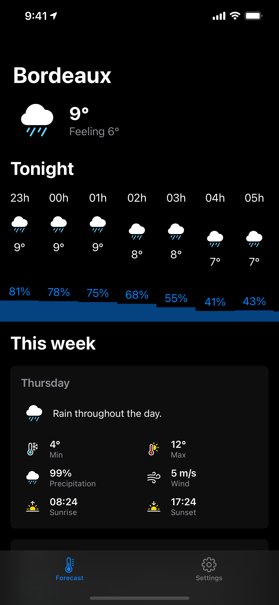

[](http://swift.org)
[](https://developer.apple.com/download/more/)

<div align=center>

<h1>Simple Weather</h1>
<a href="https://apps.apple.com/app/simple-weather/id1542742219">

</a>
<br />


</div>

## 📖 Description

A simple weather app created with SwiftUI 2.0 for iOS 14 &amp; iPadOS

## 🛠 Install

* `git clone https://github.com/mmaheo/simple-weather-ios`
* Create a new file with the following content 

```swift
public let darkSkyApiKey = "Your Api Key from dark sky"
```

* Add the `GoogleService-Info.plist` exported from your firebase project account

## 📦 Dependencies

* [Injectable](https://github.com/mmaheo/Injectable): Lightweight dependency injection framework
* [Firebase](https://github.com/firebase/firebase-ios-sdk): Firebase iOS SDK

## 👨‍💻 Developer

* Maxime Maheo
    * [LinkedIn](https://www.linkedin.com/in/maxime-maheo-120907a8/)
